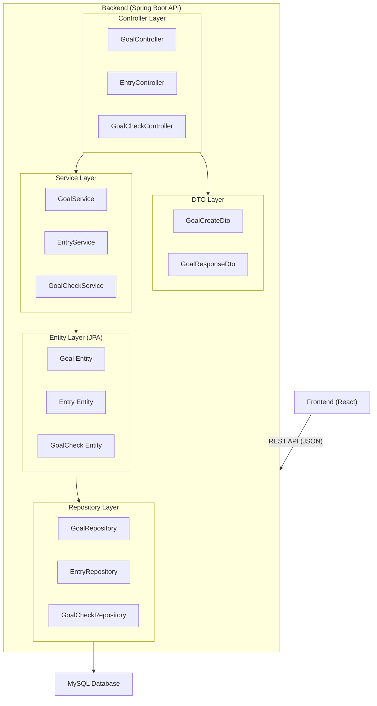

```mermaid
flowchart TD
    %% ===== FRONTEND =====
    FE["Frontend (React)"]

    %% ===== BACKEND =====
    subgraph BE["Backend (Spring Boot API)"]
        direction TB

        subgraph CTRL["Controller Layer"]
            GC["GoalController"]
            EC["EntryController"]
            GCC["GoalCheckController"]
        end

        subgraph DTO["DTO Layer"]
            GCD["GoalCreateDto"]
            GRD["GoalResponseDto"]
        end

        subgraph SRV["Service Layer"]
            GS["GoalService"]
            ES["EntryService"]
            GCS["GoalCheckService"]
        end

        subgraph ENT["Entity Layer (JPA)"]
            EGoal["Goal Entity"]
            EEntry["Entry Entity"]
            ECheck["GoalCheck Entity"]
        end

        subgraph REP["Repository Layer"]
            GR["GoalRepository"]
            ER["EntryRepository"]
            GCR["GoalCheckRepository"]
        end

        CTRL --> DTO
        CTRL --> SRV
        SRV --> ENT
        ENT --> REP
    end

    %% ===== DATABASE =====
    DB["MySQL Database"]

    FE -->|"REST API (JSON)"| BE
    REP --> DB
```
